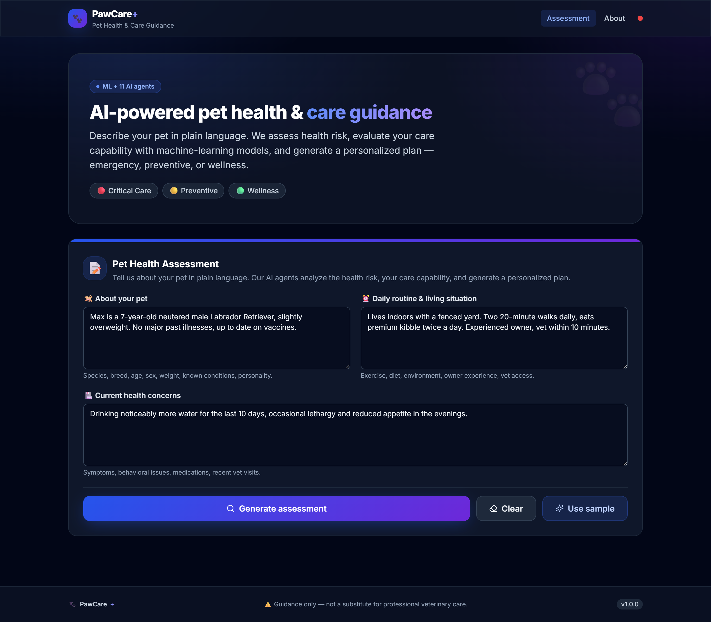
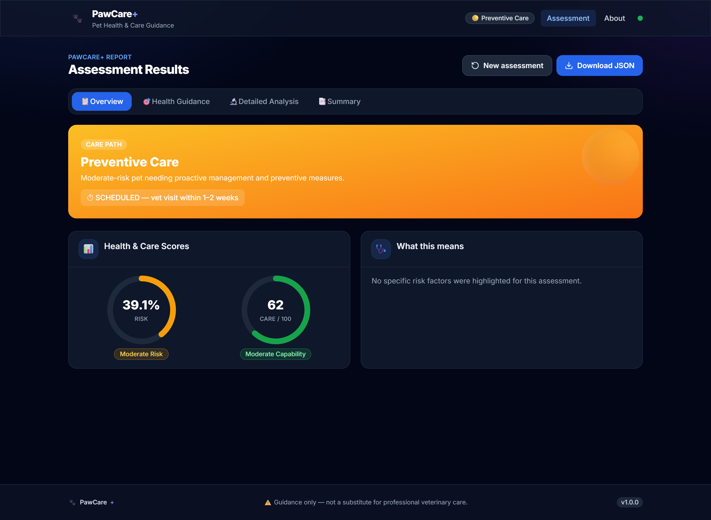
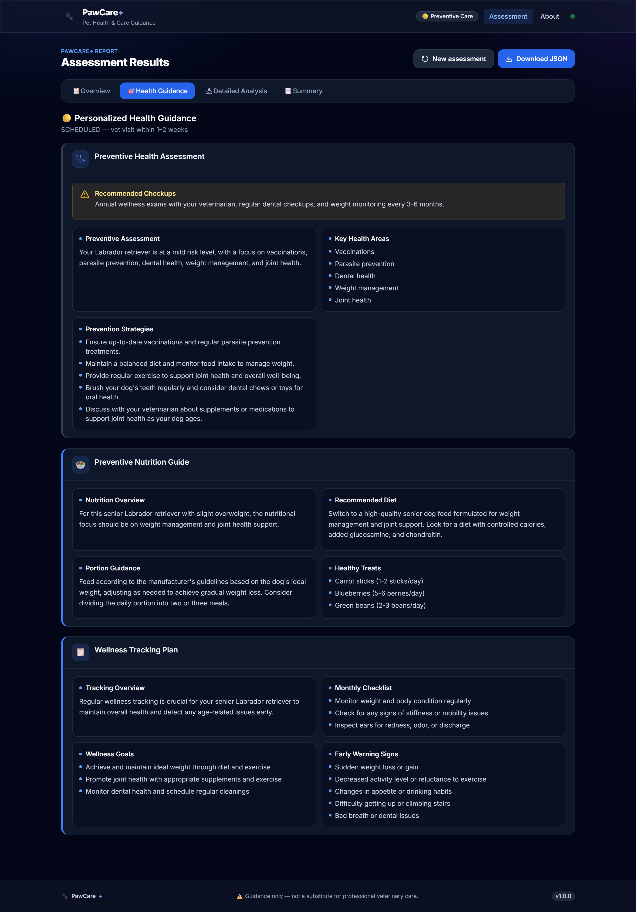
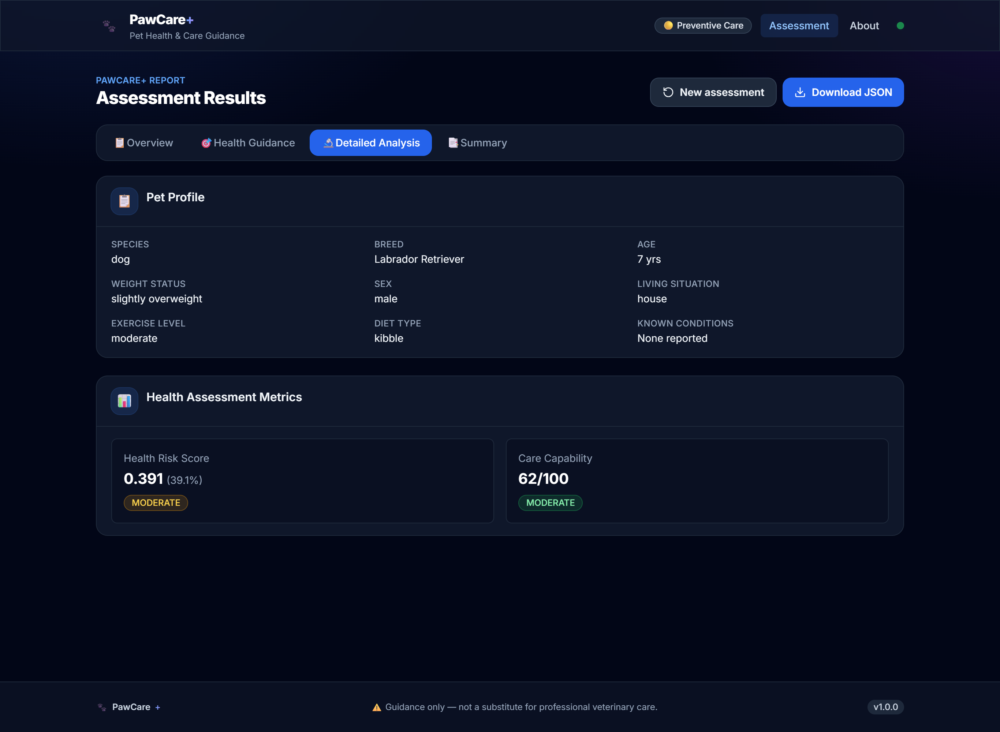
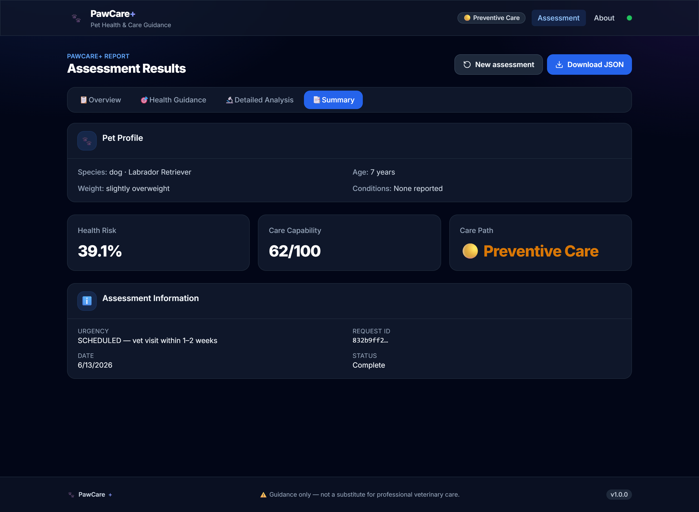

# PawCare+ - Pet Health Guidance System

## Project Documentation

---

## 🖥️ UI Preview

Captured automatically from a live end-to-end run (React frontend → FastAPI →
LangGraph) via `frontend/scripts/ui-test.mjs`. Sample input — a 7-year-old
overweight Labrador with increased thirst & lethargy — was routed to the
**Preventive Care** path: health risk **39.1%** (moderate), owner care capability
**62/100**.

**1. Assessment form (input page)** — shown filled with the sample input



**2. Results → Overview tab** (care-path banner + risk/care gauges)



**3. Results → Health Guidance tab** (path-specific AI guidance)



**4. Results → Detailed Analysis tab** (pet profile + ML metrics)



**5. Results → Summary tab**



> Regenerate with: backend on `:8000` + `npm run dev`, then `npm run ui-test`.

---

## 🐳 Run with Docker

The whole stack is containerized — a Python image for the FastAPI/LangGraph
backend and a multi-stage Node→nginx image for the React frontend. nginx serves
the built SPA and reverse-proxies `/api` to the backend, so there is no CORS to
configure.

```
┌──────────────────────────────┐        ┌──────────────────────────────┐
│ frontend (nginx)  :8080 → :80│  /api  │ backend (uvicorn)      :8000  │
│ serves React build, proxies  │ ─────▶ │ FastAPI → LangGraph → ML/LLM  │
└──────────────────────────────┘        └──────────────────────────────┘
```

**1. Configure secrets**

```bash
cp .env.example .env      # then edit .env and set OPENAI_API_KEY=sk-...
```

**2. Build & run**

```bash
docker compose up --build         # add -d to run detached
```

| Service  | URL                                                      |
| -------- | -------------------------------------------------------- |
| Frontend | <http://localhost:8080>                                  |
| API docs | <http://localhost:8000/docs>                             |
| Health   | <http://localhost:8000/api/health>                       |

**3. Stop**

```bash
docker compose down
```

### Docker files

| File                     | Purpose                                                        |
| ------------------------ | -------------------------------------------------------------- |
| `docker-compose.yml`     | Orchestrates the `backend` + `frontend` services.              |
| `backend/Dockerfile`     | Python 3.12 image; installs `requirements.txt`; runs uvicorn.  |
| `frontend/Dockerfile`    | Stage 1 builds with Node; stage 2 serves `dist/` via nginx.    |
| `frontend/nginx.conf`    | SPA fallback + `/api` reverse-proxy to `backend:8000`.         |
| `backend/.dockerignore` / `frontend/.dockerignore` | Keep build contexts lean. |

> The backend container reads `OPENAI_API_KEY` (and optional keys) from the root
> `.env` via Compose `env_file`. The bundled ML models are pinned to
> scikit-learn `1.8.x` in `requirements.txt` to match how they were trained.

---

## 📋 Table of Contents

1. [Project Overview](#project-overview)
2. [Problem Statement & Solution](#problem-statement--solution)
3. [System Architecture](#system-architecture)
4. [Workflow Explanation](#workflow-explanation)
5. [Project Structure](#project-structure)
6. [Model Selection & Rationale](#model-selection--rationale)
7. [Results & Output Examples](#results--output-examples)
8. [End Goal](#end-goal)

---

## Project Overview

### What is PawCare+?

**PawCare+** is an **AI-powered pet health guidance system** that provides personalized health assessments and care recommendations for pets. It combines machine learning predictions with large language model expertise to bridge the gap between veterinary expertise and accessible pet health guidance for general pet owners.

### Key Features:

- ✅ **Personalized Health Risk Assessment** using ML models
- ✅ **Owner Care Capability Analysis** to understand owner readiness
- ✅ **Intelligent Care Path Routing** (Critical/Preventive/Wellness)
- ✅ **Comprehensive Guidance** across 5+ domains (Emergency, Nutrition, Behavior, Wellness, Lifestyle)
- ✅ **Emergency Preparedness Planning**
- ✅ **Proactive Wellness Monitoring**

---

## Problem Statement & Solution

### Problems Faced Before PawCare+

| Problem | Description |
|---------|-------------|
| **Generic Advice** | Most online resources provide generic, one-size-fits-all guidance |
| **Expensive Vet Visits** | Every concern requires expensive professional consultation |
| **No Personalization** | No system considers individual pet's age, breed, conditions, lifestyle |
| **Emergency Unpreparedness** | Pet owners don't have emergency plans for their specific pets |
| **Lack of Monitoring** | No structured approach to track pet health proactively |

### How PawCare+ Overcomes These Problems

| Problem | PawCare+ Solution |
|---------|-------------------|
| Generic Advice | **17-field profile extraction** tailors guidance to each pet |
| Expensive Vet Visits | **Free, instant assessments** reduce unnecessary vet visits |
| No Personalization | **ML risk scoring** + **LLM personalized guidance** |
| Emergency Unpreparedness | **Specialized emergency plans** with contacts, supplies, procedures |
| Lack of Monitoring | **Daily/weekly/monthly checklists** with red flag identification |

---

## System Architecture

### High-Level Architecture

```
┌─────────────────────────────────────────────────────────────────────────────┐
│              REACT FRONTEND (frontend/)  ·  Vite + TS + Tailwind             │
│              Assessment Form → Results Dashboard (4 tabs)                    │
└─────────────────────────────────────────────────────────────────────────────┘
                                      │  POST /api/assess  (JSON)
                                      ▼
┌─────────────────────────────────────────────────────────────────────────────┐
│              FASTAPI BACKEND (backend/api/server.py)                         │
│              /api/health · /api/assess  →  thin bridge over graph.py         │
└─────────────────────────────────────────────────────────────────────────────┘
                                      │
                                      ▼
┌─────────────────────────────────────────────────────────────────────────────┐
│                      LANGGRAPH ORCHESTRATION (graph.py)                     │
│                         17-Node State Machine                               │
└─────────────────────────────────────────────────────────────────────────────┘
                                      │
        ┌─────────────────────────────┼─────────────────────────────┐
        ▼                             ▼                             ▼
┌───────────────┐           ┌───────────────┐           ┌───────────────┐
│  AGENTS LAYER │           │   ML LAYER    │           │  NODES LAYER  │
│  (16 Agents)  │           │ (2 Models)    │           │ (Integration) │
└───────────────┘           └───────────────┘           └───────────────┘
        │                             │                             │
        └─────────────────────────────┼─────────────────────────────┘
                                      ▼
┌─────────────────────────────────────────────────────────────────────────────┐
│                         STATE MANAGEMENT (state.py)                         │
│                        48-Field TypedDict with Reducers                     │
└─────────────────────────────────────────────────────────────────────────────┘
```

### Technology Stack

| Component | Technology | Purpose |
|-----------|------------|---------|
| **Frontend** | React + TypeScript, Vite, Tailwind CSS, React Query, React Router | Responsive dashboard UI with interactive tabs and metrics |
| **API** | FastAPI + Uvicorn | REST bridge (`/api/assess`) between the frontend and the workflow |
| **Orchestration** | LangGraph | State machine workflow management |
| **LLM** | OpenAI GPT-4 | Natural language understanding and generation |
| **ML** | scikit-learn, pandas, numpy | Health risk and care capability prediction |
| **Data Processing** | pandas, numpy | Data cleaning and feature engineering |
| **Configuration** | python-dotenv | API key management |

---

## Workflow Explanation

### Complete Workflow Diagram

```
┌─────────────────────────────────────────────────────────────────────────────┐
│                           ASSESSMENT START                                  │
│              (User Input via React UI → POST /api/assess)                   │
└─────────────────────────────────────────────────────────────────────────────┘
                                      │
                                      ▼
┌─────────────────────────────────────────────────────────────────────────────┐
│                      INPUT VALIDATOR AGENT                                   │
│                      • Validates pet data format                            │
│                      • Checks for completeness (min 10 chars)               │
│                      • Identifies pet type (dog/cat/other)                  │
└─────────────────────────────────────────────────────────────────────────────┘
                                      │
                    ┌─────────────────┴─────────────────┐
                    ▼                                   ▼
        ┌───────────────────────┐             ┌───────────────────────┐
        │     VALIDATION        │             │    VALIDATION         │
        │       FAILS           │             │      SUCCEEDS         │
        └───────────────────────┘             └───────────────────────┘
                    │                                   │
                    │                                   ▼
                    │                     ┌───────────────────────────────┐
                    │                     │    PET PROFILE EXTRACTOR      │
                    │                     │    • Extracts 17 attributes   │
                    │                     │    • Age, breed, symptoms     │
                    │                     │    • Behavior, diet, etc.     │
                    │                     └───────────────────────────────┘
                    │                                   │
                    │                     ┌─────────────┴─────────────┐
                    │                     ▼                           ▼
                    │           ┌───────────────────┐     ┌─────────────────────┐
                    │           │   EXTRACTION      │     │   EXTRACTION        │
                    │           │     FAILS         │     │    SUCCEEDS         │
                    │           └───────────────────┘     └─────────────────────┘
                    │                   │                           │
                    │                   │                           ▼
                    │                   │               ┌───────────────────────┐
                    │                   │               │  HEALTH RISK SCORER  │
                    │                   │               │  • ML Model Predicts  │
                    │                   │               │  • Risk Score (0-1)   │
                    │                   │               └───────────────────────┘
                    │                   │                           │
                    │                   │                           ▼
                    │                   │               ┌───────────────────────┐
                    │                   │               │ OWNER CARE CAPABILITY│
                    │                   │               │  • ML Model Predicts  │
                    │                   │               │  • Capability (0-100) │
                    │                   │               └───────────────────────┘
                    │                   │                           │
                    │                   │                           ▼
                    │                   │               ┌───────────────────────┐
                    │                   │               │   HEALTH RISK        │
                    │                   │               │     ROUTER           │
                    │                   │               │  • Risk Score Based  │
                    │                   │               │  • Routes to Paths   │
                    │                   │               └───────────────────────┘
                    │                   │                           │
                    │                   │         ┌─────────────────┼─────────────────┐
                    │                   │         ▼                 ▼                 ▼
                    │                   │   ┌─────────────┐  ┌─────────────┐  ┌─────────────┐
                    │                   │   │  CRITICAL   │  │ PREVENTIVE  │  │  WELLNESS   │
                    │                   │   │   PATH      │  │    PATH     │  │    PATH     │
                    │                   │   │  Score>0.6  │  │0.3<Score≤0.6│  │  Score≤0.3  │
                    │                   │   └─────────────┘  └─────────────┘  └─────────────┘
                    │                   │           │               │                 │
                    │                   │           ▼               ▼                 ▼
                    │                   │   ┌─────────────────────────────────────────────────┐
                    │                   │   │           PATH-SPECIFIC AGENTS                  │
                    │                   │   │                                                  │
┌───────────────────┴───────────────────┴───┴───────────────────┐  ┌─────────────────────────┐
│           SKIP PATH (Direct to Completion)                    │  │  CRITICAL PATH AGENTS   │
│  • Used when validation or extraction fails                   │  │  • Health Risk Analysis │
│  • Returns basic error message/fallback response              │  │  • Emergency Preparedness│
└───────────────────────────────────────────────────────────────┘  │  • Nutrition Critical    │
                                                                   │  • Behavioral Coaching   │
                                                                   │  • Wellness Monitoring   │
                                                                   └─────────────────────────┘
                                                                              │
┌───────────────────────────────────────────────────────────────────────────────┐
│  PREVENTIVE PATH AGENTS         │           WELLNESS PATH AGENTS              │
│  • Health Assessment            │           • Wellness Optimization           │
│  • Nutrition Preventive         │           • Nutrition Enhancement          │
│  • Wellness Tracking            │           • Lifestyle Enrichment            │
└───────────────────────────────────────────────────────────────────────────────┘
                                    │
                                    ▼
                    ┌───────────────────────────────┐
                    │     OUTPUT AGGREGATOR         │
                    │  • Combines all path outputs  │
                    │  • Consolidates findings      │
                    │  • Formats for final report   │
                    └───────────────────────────────┘
                                    │
                                    ▼
                    ┌───────────────────────────────┐
                    │   GENERATE PET HEALTH REPORT  │
                    │  • Structured health report   │
                    │  • Personalized recommendations│
                    │  • Action items & next steps  │
                    └───────────────────────────────┘
                                    │
                                    ▼
                    ┌───────────────────────────────┐
                    │      DISPLAY IN REACT UI      │
                    │  • 4 Tabs: Overview, Guidance,│
                    │    Analysis, Summary          │
                    └───────────────────────────────┘
                                    │
                                    ▼
                    ┌───────────────────────────────┐
                    │      ASSESSMENT COMPLETE      │
                    │     (Final State)             │
                    └───────────────────────────────┘
```

### Path-Specific Execution

| Path | Risk Score | Agents | Outputs |
|------|------------|--------|---------|
| **Critical** | > 0.6 | 5 Agents | Risk Analysis, Emergency Plan, Critical Nutrition, Behavioral Coaching, Monitoring |
| **Preventive** | 0.3 - 0.6 | 3 Agents | Health Assessment, Nutrition Guide, Wellness Tracking |
| **Wellness** | ≤ 0.3 | 3 Agents | Wellness Optimization, Nutrition Enhancement, Lifestyle Enrichment |

---

## Project Structure

The repository is split into two independent apps — a React **frontend** and a
Python **backend** — plus shared config at the root:

```
Hackthon/
├── frontend/                        # React + TypeScript + Vite + Tailwind UI
│   ├── src/
│   │   ├── api/                     # Typed fetch client + React Query hooks
│   │   ├── components/ui/           # Reusable design-system components
│   │   ├── components/layout/       # Header, Footer, AppLayout
│   │   ├── features/assessment/     # Form, results tabs, guidance renderer
│   │   ├── pages/                   # Home, About, NotFound (lazy-loaded routes)
│   │   ├── types/  utils/  lib/     # API types, formatters, query client
│   │   └── main.tsx  App.tsx        # Entry point + router
│   ├── index.html  vite.config.ts  tailwind.config.js  package.json
│   ├── Dockerfile  nginx.conf       # Build → nginx static serve + /api proxy
│   ├── scripts/ui-test.mjs          # Headless screenshot test (npm run ui-test)
│   └── .env.example
│
├── backend/                         # Python LangGraph workflow + ML + API
│   ├── api/                         # FastAPI bridge (React ↔ workflow)
│   │   ├── server.py                # App, CORS, /api/health, /api/assess
│   │   └── schemas.py               # Pydantic request/response models
│   ├── Dockerfile                   # Python 3.12 → uvicorn
│   ├── graph.py                     # LangGraph Orchestration Engine
│   ├── state.py                     # State Management (51 fields with reducers)
│   ├── requirements.txt             # Python dependencies (incl. FastAPI/uvicorn)
│   │
│   ├── agents/                      # 16 Agent Modules — processing logic
│   │   ├── base_llm_agent.py        #   Abstract base class for LLM agents
│   │   ├── input_validator_agent.py #   Input validation logic
│   │   ├── pet_profile_extractor_llm.py        # LLM profile extraction (17 fields)
│   │   ├── pet_health_risk_scorer_ml.py        # ML health risk prediction
│   │   ├── owner_care_capability_ml.py         # ML care capability prediction
│   │   ├── pet_health_risk_analysis_llm.py     # CRITICAL — health analysis
│   │   ├── emergency_preparedness_llm.py       # CRITICAL — emergency planning
│   │   ├── nutrition_critical_llm.py           # CRITICAL — critical nutrition
│   │   ├── behavioral_coaching_llm.py          # CRITICAL — behavior guidance
│   │   ├── wellness_monitoring_llm.py          # CRITICAL — monitoring plan
│   │   ├── health_assessment_preventive_llm.py # PREVENTIVE — health assessment
│   │   ├── nutrition_preventive_llm.py         # PREVENTIVE — nutrition guide
│   │   ├── wellness_tracking_preventive_llm.py # PREVENTIVE — wellness tracking
│   │   ├── wellness_optimization_llm.py        # WELLNESS — optimization
│   │   ├── nutrition_wellness_llm.py           # WELLNESS — nutrition enhancement
│   │   └── lifestyle_enrichment_llm.py         # WELLNESS — enrichment
│   │
│   ├── nodes/                       # 17 Execution Nodes — graph integration
│   │   ├── input_validator_node.py             # Input validation
│   │   ├── pet_profile_extractor_node.py       # Profile extraction
│   │   ├── pet_health_risk_scorer_node.py      # ML health risk
│   │   ├── owner_care_capability_node.py       # ML care capability
│   │   ├── health_risk_router_node.py          # Routing decision
│   │   ├── ...                                  # 5 critical / 3 preventive / 3 wellness
│   │   └── output_aggregator_node.py           # Final output aggregation
│   │
│   ├── ml/                          # Machine Learning Pipeline
│   │   ├── train_pipeline.py        #   ML pipeline orchestrator
│   │   ├── data_cleaning/           #   Data cleaning scripts
│   │   ├── train_model/             #   Model training scripts
│   │   ├── evaluation/              #   Model evaluation
│   │   └── models/                  #   Trained artifacts (.pkl, sklearn 1.8.x)
│   │
│   ├── utils/
│   │   └── openai_client.py         # OpenAI client with key rotation
│   │
│   ├── workflow/
│   │   └── workflow.py              # Routing logic & metadata
│   │
│   └── data/                        # Training / evaluation / processed CSVs
│
├── docker-compose.yml               # Full-stack: frontend + backend containers
├── .env.example                     # Env template (copy → .env, never commit keys)
├── .gitignore
├── README.md
└── RUN.md                           # How to run frontend + backend
```

### File-by-File Explanation

| File | Purpose | Why It's Important |
|------|---------|-------------------|
| **frontend/** | React + TypeScript UI | Responsive dashboard for input and results display |
| **api/server.py** | FastAPI entry point | REST API (`/api/assess`) the frontend calls |
| **api/schemas.py** | Pydantic models | Validates requests, shapes responses |
| **graph.py** | LangGraph orchestration | Manages 17-node workflow execution |
| **state.py** | Central state management | 51-field TypedDict with custom reducers |
| **agents/base_llm_agent.py** | Base class for LLM agents | Code reuse, consistent error handling |
| **agents/input_validator_agent.py** | Input validation | Prevents empty/invalid inputs |
| **agents/pet_profile_extractor_llm.py** | 17-field extraction | Structured pet profile from free text |
| **agents/pet_health_risk_scorer_ml.py** | ML risk prediction | Objective health risk scoring |
| **agents/owner_care_capability_ml.py** | ML capability prediction | Assesses owner's ability to care |
| **agents/*_llm.py (11 files)** | Path-specific guidance | Specialized recommendations per path |
| **nodes/*.py (17 files)** | Graph integration | Connect agents to LangGraph workflow |
| **ml/train_pipeline.py** | ML pipeline orchestrator | End-to-end model training |
| **ml/data_cleaning/*.py** | Data cleaning | Prepares training data |
| **ml/train_model/*.py** | Model training | Trains RandomForest/XGBoost models |
| **ml/evaluation/evaluate_models.py** | Model evaluation | Validates model performance |
| **utils/openai_client.py** | OpenAI client | API key rotation, error handling |
| **workflow/workflow.py** | Workflow metadata | Routing thresholds, token budgets |

---

## Model Selection & Rationale

### Health Risk Model

**Purpose**: Predict pet health risk score (0-1) based on pet profile

**Features (7)**:
- Categorical: pet_species, weight_status, living_situation, exercise_level
- Numerical: age_years, conditions_count, allergies_count

**Model Selected: RandomForestRegressor**

| Why RandomForest? | Explanation |
|-------------------|-------------|
| **Handles Mixed Data** | Works well with both categorical and numerical features |
| **Feature Importance** | Provides interpretability (weight_status most important at 42%) |
| **Robust to Outliers** | Less sensitive to outliers than linear models |
| **No Scaling Required** | Tree-based models don't require feature scaling |
| **Good Performance** | Achieved R² = 0.639 on test data |

**Why Not Other Models?**

| Model | Why Not Used |
|-------|--------------|
| **Linear Regression** | Cannot capture non-linear relationships; assumes linearity |
| **Neural Networks** | Overkill for 7 features; requires large data; less interpretable |
| **SVM** | Poor performance with mixed data types; slower training |
| **KNN** | Poor with high-dimensional categorical data |

---

### Care Capability Model

**Purpose**: Predict owner care capability score (0-100)

**Features (3)**:
- owner_experience (novice, experienced, expert)
- vet_access (regular, emergency only, limited, none)
- owner_commitment (casual, dedicated, obsessive)

**Model Selected: RandomForestRegressor**

| Why RandomForest? | Explanation |
|-------------------|-------------|
| **Simple but Effective** | 3 features only - tree-based models handle categorical well |
| **Interpretable** | Feature importance shows owner_experience most important (71%) |
| **Good Performance** | Achieved R² = 0.510 on test data |

**Why Not XGBoost?**
- XGBoost was attempted but had import issues
- RandomForest provides comparable performance with simpler implementation

---

### Model Performance Summary

| Model | Train R² | Test R² | MAE | RMSE |
|-------|----------|---------|-----|------|
| **Health Risk** | 0.687 | 0.639 | 0.067 | 0.085 |
| **Care Capability** | 0.524 | 0.510 | 8.07 | 10.02 |

**Feature Importance - Health Risk Model:**
1. weight_status: 42.1%
2. exercise_level: 22.7%
3. age_years: 20.5%
4. living_situation: 8.5%
5. pet_species: 5.3%
6. allergies_count: 1.0%
7. conditions_count: 0.0%

**Feature Importance - Care Capability Model:**
1. owner_experience: 71.4%
2. owner_commitment: 14.6%
3. vet_access: 14.0%

---

## Results & Output Examples

### Example 1: Critical Path (High Risk - Senior Dog with Diabetes)

**Input:**

```
🐕 About Your Pet:
My dog is a 12-year-old Labrador Retriever named Max. He's male, neutered, and weighs about 32kg. He's generally been healthy but has had some joint issues in the past.

⏰ Daily Routine & Living Situation:
Max eats twice daily - senior kibble in the morning and wet food at night. He gets two short 15-minute walks daily and sleeps indoors on an orthopedic bed. He lives in a house with a small backyard.

🏥 Current Health Concerns:
Recently, Max has been drinking much more water than usual and seems very tired after short walks. He's also been coughing occasionally, especially at night. His appetite has decreased and he's lost some weight.
```

**ML Output:**
- Health Risk Score: **0.85** (Critical)
- Care Capability Score: **75/100**

---

### Output Screenshot (Text Representation)

```
╔══════════════════════════════════════════════════════════════════════════════╗
║                         PAWCARE+ ASSESSMENT RESULTS                          ║
╚══════════════════════════════════════════════════════════════════════════════╝

┌─────────────────────────────────────────────────────────────────────────────┐
│  TAB 1: OVERVIEW                                                           │
├─────────────────────────────────────────────────────────────────────────────┤
│                                                                             │
│  ┌─────────────────┐  ┌─────────────────┐  ┌─────────────────┐             │
│  │ Health Risk    │  │ Care Capability │  │ Care Path      │             │
│  │    85.0%       │  │     75/100      │  │ 🔴 CRITICAL    │             │
│  │    HIGH RISK   │  │   MODERATE      │  │                │             │
│  └─────────────────┘  └─────────────────┘  └─────────────────┘             │
│                                                                             │
│  📋 Assessment Details:                                                     │
│  • Max is a 12-year-old Labrador with signs of diabetes and possible       │
│    heart issues. Immediate veterinary attention required.                   │
│                                                                             │
└─────────────────────────────────────────────────────────────────────────────┘

┌─────────────────────────────────────────────────────────────────────────────┐
│  TAB 2: HEALTH GUIDANCE                                                    │
├─────────────────────────────────────────────────────────────────────────────┤
│                                                                             │
│  🔴 Health Risk Analysis:                                                   │
│  ┌───────────────────────────────────────────────────────────────────────┐ │
│  │ Honest Risk Assessment:                                                │ │
│  │ Max's symptoms (increased thirst, lethargy, weight loss, cough)       │ │
│  │ suggest possible diabetes mellitus and/or heart failure. Immediate    │ │
│  │ veterinary evaluation is critical.                                    │ │
│  │                                                                        │ │
│  │ Critical Risk Factors:                                                 │ │
│  │ • Advanced age (12 years) with multiple symptoms                       │ │
│  │ • New onset cough indicating possible cardiac involvement              │ │
│  │ • Increased thirst and weight loss suggestive of diabetes             │ │
│  │ • Lethargy and decreased appetite                                      │ │
│  │                                                                        │ │
│  │ Warning Signs to Monitor:                                              │ │
│  │ • Difficulty breathing or increased respiratory effort                 │ │
│  │ • Collapse or inability to stand                                       │ │
│  │ • Severe lethargy or unresponsiveness                                  │ │
│  │ • Vomiting or diarrhea                                                 │ │
│  │                                                                        │ │
│  │ Urgency Timeline:                                                      │ │
│  │ 🚨 Seek emergency veterinary care within 24 hours.                    │ │
│  │    If breathing becomes labored, go immediately.                      │ │
│  └───────────────────────────────────────────────────────────────────────┘ │
│                                                                             │
│  🚨 Emergency Preparedness:                                                 │
│  ┌───────────────────────────────────────────────────────────────────────┐ │
│  │ Emergency Contacts:                                                    │ │
│  │ • 24/7 Emergency Vet: [Your Local Emergency Veterinary Hospital]      │ │
│  │ • Regular Veterinarian: Dr. Smith - (555) 123-4567                    │ │
│  │ • Pet Poison Control: (888) 426-4435                                   │ │
│  │                                                                        │ │
│  │ First Aid Supplies:                                                    │ │
│  │ • 📋 Medical records folder                                            │ │
│  │ • 💊 7-day supply of medications                                       │ │
│  │ • 🩹 Pet first aid kit                                                 │ │
│  │ • 📸 Recent photos for identification                                  │ │
│  │                                                                        │ │
│  │ Crisis Procedures:                                                     │ │
│  │ • Diabetic emergency: Check glucose, rub honey on gums if low         │ │
│  │ • Cardiac event: Keep calm, limit movement, seek emergency care       │ │
│  │ • Seizure: Time it, move objects away, do not restrain                │ │
│  └───────────────────────────────────────────────────────────────────────┘ │
│                                                                             │
│  🥗 Critical Nutrition Plan:                                                │
│  ┌───────────────────────────────────────────────────────────────────────┐ │
│  │ Recommended Diet:                                                      │ │
│  │ Hill's Prescription Diet w/d or Royal Canin Glycobalance -            │ │
│  │ therapeutic diets designed for diabetic dogs with consistent          │ │
│  │ carbohydrate profiles.                                                │ │
│  │                                                                        │ │
│  │ Feeding Schedule:                                                      │ │
│  │ Feed exactly every 12 hours, immediately before insulin injections.   │ │
│  │ Consistency in timing and portion size is CRITICAL.                   │ │
│  │                                                                        │ │
│  │ Foods to Avoid:                                                        │ │
│  │ • High-fat treats and table scraps                                     │ │
│  │ • Foods with simple sugars or corn syrup                               │ │
│  │ • Semi-moist dog foods (often high in sugar)                          │ │
│  └───────────────────────────────────────────────────────────────────────┘ │
│                                                                             │
└─────────────────────────────────────────────────────────────────────────────┘

┌─────────────────────────────────────────────────────────────────────────────┐
│  TAB 3: DETAILED ANALYSIS                                                  │
├─────────────────────────────────────────────────────────────────────────────┤
│                                                                             │
│  📋 Pet Profile Information:                                                │
│  ┌───────────────────────────────────────────────────────────────────────┐ │
│  │ Species: dog          │ Breed: labrador        │ Age: 12 years        │ │
│  │ Weight: 32kg          │ Sex: male              │ Neutered: Yes        │ │
│  │ Living: house         │ Exercise: light        │ Diet: senior kibble  │ │
│  │ Known Conditions: arthritis, possible diabetes, possible heart disease│ │
│  └───────────────────────────────────────────────────────────────────────┘ │
│                                                                             │
│  📊 Health Assessment Metrics:                                              │
│  ┌───────────────────────────────────────────────────────────────────────┐ │
│  │ Health Risk Score: 0.85 (HIGH)                                        │ │
│  │ Care Capability: 75/100 (MODERATE)                                    │ │
│  │ Risk Factors: age (0.4), conditions (0.3), symptoms (0.2)             │ │
│  └───────────────────────────────────────────────────────────────────────┘ │
│                                                                             │
└─────────────────────────────────────────────────────────────────────────────┘

┌─────────────────────────────────────────────────────────────────────────────┐
│  TAB 4: SUMMARY                                                            │
├─────────────────────────────────────────────────────────────────────────────┤
│                                                                             │
│  🐾 Pet Profile:                                                           │
│  • Species: Dog • Breed: Labrador • Age: 12 years                         │
│  • Weight Status: Normal • Conditions: Arthritis, possible diabetes       │
│                                                                             │
│  📈 Health Assessment:                                                     │
│  • Health Risk Score: 85.0% • Care Capability: 75/100                     │
│                                                                             │
│  🚨 Care Path: CRITICAL                                                    │
│  • Urgency Level: IMMEDIATE - Veterinary attention required within 24 hrs │
│                                                                             │
│  ℹ️ Assessment Information:                                                │
│  • Request ID: abc12345... • Timestamp: 2024-03-24                        │
│                                                                             │
└─────────────────────────────────────────────────────────────────────────────┘
```

---

### Example 2: Preventive Path (Moderate Risk - Overweight Beagle)

**Input:**

```
🐕 About Your Pet:
My dog is a 5-year-old Beagle named Buddy. He's male, neutered, and weighs about 15kg. He's generally healthy but has a sensitive stomach. He's very food-motivated and energetic.

⏰ Daily Routine & Living Situation:
Buddy eats twice daily - sensitive stomach formula kibble. He gets two 30-minute walks daily and loves sniffing everything. He lives in an apartment and sleeps on his dog bed.

🏥 Current Health Concerns:
Over the past week, Buddy has had intermittent soft stool and has been passing gas more than usual. He's still eating and seems energetic, but I'm concerned about his digestive health.
```

**ML Output:**
- Health Risk Score: **0.45** (Moderate)
- Care Capability Score: **70/100**

---

### Output Screenshot (Text Representation)

```
╔══════════════════════════════════════════════════════════════════════════════╗
║                         PAWCARE+ ASSESSMENT RESULTS                          ║
╚══════════════════════════════════════════════════════════════════════════════╝

┌─────────────────────────────────────────────────────────────────────────────┐
│  TAB 1: OVERVIEW                                                           │
├─────────────────────────────────────────────────────────────────────────────┤
│                                                                             │
│  ┌─────────────────┐  ┌─────────────────┐  ┌─────────────────┐             │
│  │ Health Risk    │  │ Care Capability │  │ Care Path      │             │
│  │    45.0%       │  │     70/100      │  │ 🟡 PREVENTIVE  │             │
│  │  MODERATE RISK │  │   MODERATE      │  │                │             │
│  └─────────────────┘  └─────────────────┘  └─────────────────┘             │
│                                                                             │
│  📋 Assessment Details:                                                     │
│  • Buddy has moderate health risks due to digestive issues. Proactive      │
│    management of diet and monitoring can prevent progression.              │
│                                                                             │
└─────────────────────────────────────────────────────────────────────────────┘

┌─────────────────────────────────────────────────────────────────────────────┐
│  TAB 2: HEALTH GUIDANCE                                                    │
├─────────────────────────────────────────────────────────────────────────────┤
│                                                                             │
│  🩺 Preventive Health Assessment:                                           │
│  ┌───────────────────────────────────────────────────────────────────────┐ │
│  │ Preventive Assessment:                                                 │ │
│  │ Buddy, a 5-year-old Beagle, has a moderate health risk score of 45%   │ │
│  │ due to digestive issues. Proactive management of diet and monitoring  │ │
│  │ can prevent progression.                                              │ │
│  │                                                                        │ │
│  │ Key Health Areas to Monitor:                                           │ │
│  │ • Digestive health                                                     │ │
│  │ • Weight management                                                    │ │
│  │ • Dental health                                                        │ │
│  │ • Parasite prevention                                                  │ │
│  │                                                                        │ │
│  │ Recommended Checkups:                                                  │ │
│  │ • Wellness exam: Every 6 months                                        │ │
│  │ • Dental check: Annually                                               │ │
│  │ • Digestive evaluation: As needed                                      │ │
│  └───────────────────────────────────────────────────────────────────────┘ │
│                                                                             │
│  🥗 Preventive Nutrition Guide:                                             │
│  ┌───────────────────────────────────────────────────────────────────────┐ │
│  │ Nutrition Overview:                                                    │ │
│  │ A balanced, adult-appropriate diet with easily digestible ingredients │ │
│  │ is essential for Buddy's digestive health.                            │ │
│  │                                                                        │ │
│  │ Recommended Diet:                                                      │ │
│  │ Continue with sensitive stomach formula. Look for limited ingredient  │ │
│  │ diets with prebiotics and probiotics.                                  │ │
│  │                                                                        │ │
│  │ Portion Guidance:                                                      │ │
│  │ Feed 1-1.5 cups total daily, divided into 2 meals. Use a measuring    │ │
│  │ cup for accuracy. Avoid free-feeding.                                 │ │
│  │                                                                        │ │
│  │ Healthy Treats:                                                        │ │
│  │ • Small pieces of cooked pumpkin (great for digestion)                │ │
│  │ • Plain yogurt (probiotics)                                            │ │
│  │ • Green beans                                                          │ │
│  │ • Commercial sensitive stomach treats                                 │ │
│  └───────────────────────────────────────────────────────────────────────┘ │
│                                                                             │
└─────────────────────────────────────────────────────────────────────────────┘

┌─────────────────────────────────────────────────────────────────────────────┐
│  TAB 3: DETAILED ANALYSIS                                                  │
├─────────────────────────────────────────────────────────────────────────────┤
│                                                                             │
│  📋 Pet Profile Information:                                                │
│  ┌───────────────────────────────────────────────────────────────────────┐ │
│  │ Species: dog          │ Breed: beagle          │ Age: 5 years         │ │
│  │ Weight: 15kg          │ Sex: male              │ Neutered: Yes        │ │
│  │ Living: apartment     │ Exercise: moderate     │ Diet: sensitive kibble│ │
│  │ Known Conditions: sensitive stomach                                   │ │
│  └───────────────────────────────────────────────────────────────────────┘ │
│                                                                             │
└─────────────────────────────────────────────────────────────────────────────┘
```

---

## End Goal

### Primary Objectives

1. **Accessible Pet Healthcare**
   - Provide free, instant, personalized guidance to all pet owners
   - Reduce unnecessary veterinary visits while identifying genuine emergencies

2. **Empower Pet Owners**
   - Educate owners about their pet's specific health needs
   - Provide actionable recommendations they can implement immediately

3. **Prevent Health Crises**
   - Early identification of health issues through monitoring
   - Proactive wellness strategies to maintain optimal health

4. **Emergency Preparedness**
   - Every pet owner should have a tailored emergency plan
   - Reduce panic during actual emergencies

5. **Scalable Platform**
   - Handle unlimited users simultaneously
   - Continuously improve models with more data

### Success Metrics

| Metric | Target |
|--------|--------|
| **User Satisfaction** | > 90% positive feedback |
| **Accuracy of Risk Assessment** | > 80% correlation with vet diagnosis |
| **User Action Rate** | > 70% of users implement at least one recommendation |
| **Emergency Plan Adoption** | > 50% of users create emergency kit |
| **System Uptime** | > 99.9% |

### Future Roadmap

| Phase | Features |
|-------|----------|
| **Phase 2** | Mobile app, push notifications, appointment reminders |
| **Phase 3** | Image recognition for symptoms, vet integration portal |
| **Phase 4** | Historical tracking, health trends analysis |
| **Phase 5** | Multi-language support, community features |

---

## Conclusion

**PawCare+ successfully bridges the gap between veterinary expertise and accessible pet health guidance** by combining machine learning for objective risk assessment with large language models for personalized, human-like recommendations. The system's modular architecture, intelligent routing, and comprehensive output make it a valuable tool for pet owners seeking to understand and improve their pet's health.

The project demonstrates:
- ✅ End-to-end ML pipeline implementation
- ✅ Complex workflow orchestration with LangGraph
- ✅ Integration of ML and LLM technologies
- ✅ Production-ready error handling and logging
- ✅ Modern, responsive React + TypeScript interface

---

*PawCare+ - AI-Powered Pet Health Guidance System*
*Version 1.0.0*

